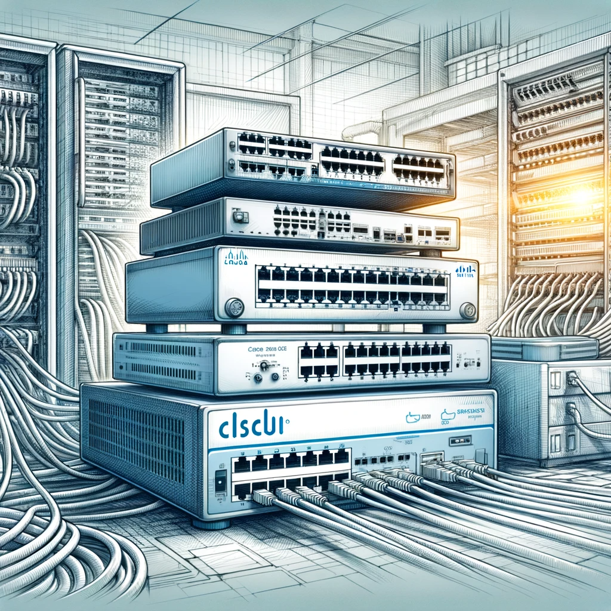

# **Cisco: A Comprehensive Guide and Cheat Sheet**

</img>

## **Introduction**
In today's interconnected world, networking is a critical aspect of any business or technological endeavor. Cisco Systems, a leader in networking technology, offers a broad range of products and solutions that are fundamental in building and managing modern networks. This guide serves as a comprehensive cheat sheet to understand Cisco, its importance, and its features.

## **Features and Usage of Cisco**

### Expanded General Commands
1. **`enable`**: Switch to the administrative mode. This command allows you to execute higher-level commands that require administrative privileges.
2. **`configure terminal`**: Enter configuration mode. In this mode, you can make changes to the device's configuration.
3. **`show running-config`**: Display the current active configuration. This command shows the configuration currently in use by the device.
4. **`show startup-config`**: Show the startup configuration. This is the configuration that the device will use the next time it restarts.
5. **`copy running-config startup-config`**: Save the active configuration. This command saves the current running configuration to the startup configuration.
6. **`interface [interface_name]`**: To configure a specific interface. Replace `[interface_name]` with the actual name of the interface you wish to configure.
7. **`exit`**: Exit the current mode. This command will take you back to the previous mode.
8. **`show version`**: Display the device's software version. This command is useful for checking the software version of your Cisco device.
9. **`reload`**: Restart the device. This command is used to reboot the device, which can be necessary after certain configurations or updates.
10. **`show ip interface brief`**: Show a brief overview of the device's interfaces and their IP configurations. This command provides a quick way to view the status and configuration of all interfaces on the device.
These commands form the basis of managing and configuring Cisco devices. Remember to use them carefully, as they can significantly impact the operation of your network.

### Expanded Basic Routing and Switching Commands
1. **`show ip route`**: Display the routing table. This command shows the routes that the router knows and how it routes traffic.
2. **`show ip interface brief`**: Show the status of IP interfaces. Provides a quick overview of the interface statuses and their IP addresses.
3. **`ip address [ip_address] [subnet_mask]`**: Assign an IP address to an interface. Replace `[ip_address]` and `[subnet_mask]` with the actual IP address and subnet mask.
4. **`no shutdown`**: Activate the interface. This command brings an interface up, making it operational.
5. **`router ospf [process_id]`**: Start OSPF configuration. Replace `[process_id]` with the OSPF process identifier.
6. **`network [network_address] [wildcard_mask] area [area_number]`**: Define a network for OSPF. This command is used within OSPF configuration mode to specify which networks to include in the OSPF process.
7. **`show vlan`**: Display VLAN information. This command lists all VLANs currently configured on the switch.
8. **`switchport mode access`**: Set a switch port to access mode. This is used to configure a port for a single VLAN.
9. **`switchport access vlan [vlan_id]`**: Assign a port to a VLAN. Replace `[vlan_id]` with the VLAN number.
10. **`ip route [destination_network] [subnet_mask] [next_hop_address]`**: Add a static route. Replace `[destination_network]`, `[subnet_mask]`, and `[next_hop_address]` with the appropriate network, mask, and gateway.

These commands provide essential functionalities for managing routing and switching in a Cisco network environment. They are fundamental for network engineers and administrators working with Cisco systems.

### Expanded Security and Firewall Settings Commands
1. **`access-list [number] permit|deny [protocol] [source_ip] [wildcard_mask]`**: Create an access list. This command defines rules for permitting or denying traffic based on the specified criteria.
2. **`interface [interface_name]`**: Select an interface to apply the access list. Replace `[interface_name]` with the name of the interface where the access list will be applied.
3. **`ip access-group [access_list_number] in|out`**: Apply the access list to incoming or outgoing traffic. This command associates an access list with a particular interface for filtering traffic.
4. **`show access-lists`**: Display all access lists configured on the router. This command is useful for reviewing your access list configurations.
5. **`crypto key generate rsa`**: Generate RSA keys for SSH. This command is necessary for enabling SSH on the device.
6. **`ip ssh version 2`**: Set the SSH version to 2. This command ensures the use of the more secure SSH version 2.
7. **`line vty 0 4`**: Access the VTY (Virtual Teletype) lines. This command is used before configuring remote access settings like Telnet or SSH.
8. **`login local`**: Use local username and password for remote access. This command sets the device to use locally defined usernames and passwords for authentication.
9. **`username [username] privilege [level] secret [password]`**: Create a local user account. Replace `[username]`, `[level]`, and `[password]` with your chosen username, privilege level, and password.
10. **`service password-encryption`**: Encrypt passwords in the configuration file. This command is used to enhance security by encrypting plain text passwords.
11. **`control-plane`**: Access control plane settings. This command is used for configuring settings that affect the control plane of Cisco devices.
12. **`zone security [zone_name]`**: Define a security zone. Replace `[zone_name]` with the name of the new security zone.
13. **`zone-pair security [source_zone] [dest_zone]`**: Create a policy between two zones. This is used in Zone-Based Policy Firewall configuration.
14. **`class-map type inspect [class_map_name]`**: Define a class map for inspecting traffic. Replace `[class_map_name]` with the name of your class map.
15. **`policy-map type inspect [policy_map_name]`**: Create a policy map for inspecting traffic. Replace `[policy_map_name]` with the name of your policy map.
16. **`inspect [protocol]`**: Specify the protocol to inspect within a policy map.
17. **`service-policy type inspect [policy_map_name] in|out`**: Apply an inspect policy map to an interface or zone pair.

These commands represent a fundamental toolkit for managing security and firewall settings on Cisco devices, allowing for detailed control over network traffic and access. They play a crucial role in ensuring the integrity and security of the network infrastructure.

### Expanded VLAN and Switch Configuration Commands
1. **`vlan [vlan_id]`**: Create a VLAN. Replace `[vlan_id]` with the ID number of the VLAN you want to create.
2. **`name [vlan_name]`**: Name the VLAN. Assign a descriptive name to the VLAN for easier identification.
3. **`interface [interface_name]`**: Select an interface to assign to a VLAN. Replace `[interface_name]` with the actual name of the interface you're configuring.
4. **`switchport mode access`**: Set the interface to access mode. This configures the port to carry traffic for only one VLAN.
5. **`switchport access vlan [vlan_id]`**: Assign the interface to a specific VLAN. Use this command to specify which VLAN the interface belongs to.
6. **`show vlan brief`**: Display a brief summary of all VLANs. This command is useful for quickly viewing the VLAN configurations on the switch.
7. **`switchport mode trunk`**: Set the interface to trunk mode. This allows the port to carry traffic for multiple VLANs.
8. **`switchport trunk allowed vlan [vlan_list]`**: Specify which VLANs are allowed on a trunk port. Replace `[vlan_list]` with the VLAN IDs that should be allowed.
9. **`switchport trunk native vlan [vlan_id]`**: Set the native VLAN for a trunk port. Native VLAN frames are not tagged with a VLAN ID.
10. **`switchport nonegotiate`**: Prevent DTP (Dynamic Trunking Protocol) from negotiating the link type. This is useful for security and when connecting to non-Cisco devices.
11. **`vlan database`**: Enter the VLAN database mode. This is an older method for VLAN configuration.
12. **`vtp mode [server|client|transparent]`**: Set the VTP (VLAN Trunking Protocol) mode. This command is used for configuring VTP which helps manage VLANs across multiple switches.
13. **`vtp domain [domain_name]`**: Define the VTP domain name. This name must be the same across all switches in the VTP domain.
14. **`vtp password [password]`**: Set a VTP domain password. This adds a layer of security for VTP information.
15. **`vtp version [version_number]`**: Set the VTP version. This command specifies which version of VTP the switch should use.
16. **`vtp pruning`**: Enable VTP pruning to increase network efficiency. This feature limits VLAN traffic to only those trunk links that actually need the traffic.
17. **`show vtp status`**: Display VTP configuration information. This command provides details about the VTP configuration on the switch.

These commands form an essential toolkit for anyone working with VLANs and switches in a Cisco environment, facilitating efficient network segmentation and management.

### Expanded List of Other Useful Commands
1. **`ping [ip_address]`**: Test network connectivity. This command sends ICMP echo requests to the specified IP address to check connectivity.
2. **`traceroute [ip_address]`**: Trace the path of packets across the network. This is useful for identifying the route taken by packets to reach a destination.
3. **`show interfaces`**: Display status and statistics of interfaces. This command provides detailed information about each network interface on the device.
4. **`show version`**: Show device version and hardware information. It gives details about the software version, device model, and other hardware information.
5. **`show ip protocols`**: Display the routing protocols configured on the router. This command helps in troubleshooting and verifying the routing protocols in use.
6. **`show ip nat translations`**: Show current NAT (Network Address Translation) translations. Useful in diagnosing NAT configurations and operations.
7. **`debug [condition]`**: Enable specific debugging output. This is a powerful troubleshooting tool that provides real-time diagnostic information about network operations.
8. **`show running-config | include [keyword]`**: Search for specific keywords in the running configuration. This can quickly pinpoint specific configuration lines.
9. **`clock set [hh:mm:ss] [month] [day] [year]`**: Set the system clock. Accurate time settings are important for logging, debugging, and various network protocols.
10. **`show cdp neighbors`**: Display information about directly connected Cisco devices. This command is part of the Cisco Discovery Protocol (CDP) and is useful for network topology discovery.
11. **`clear counters [interface]`**: Reset the interface counters. This can help start fresh when monitoring interface statistics for troubleshooting.
12. **`show logging`**: Display the system log. This command is vital for reviewing events and errors logged by the system.
13. **`write memory`** or **`copy running-config startup-config`**: Save the current configuration to the startup configuration. This ensures that changes made will persist after a reboot.
14. **`show process cpu`**: Display CPU usage statistics. This helps in diagnosing high CPU utilization issues.
15. **`show ip dhcp binding`**: List DHCP bindings. This shows the assigned IP addresses and their corresponding MAC addresses.
16. **`show environment`**: Check the hardware environment. This command provides information about power supplies, temperature, and other physical environment conditions.
17. **`telnet [ip_address]`**: Remote access to another device using Telnet. Useful for managing devices remotely but less secure than SSH.
18. **`ssh [ip_address]`**: Secure remote access to another device using SSH. Preferred over Telnet for its security features.
19. **`show vlan`**: Display VLAN information. This command shows all VLANs configured on a switch.
20. **`show ip interface`**: Show detailed IP information of interfaces. This provides a more detailed view than `show ip interface brief`.

These commands cover a wide range of functionalities from basic network testing and diagnostics to detailed system information and configuration verification, making them indispensable in the toolkit of network administrators and engineers

## **Conclusion**
Cisco remains a cornerstone of modern networking. Understanding its features and learning the basic commands is essential for anyone involved in network administration or IT infrastructure. This cheat sheet provides a foundation, but the vast array of Cisco's offerings means there's always more to learn and explore in this dynamic field.

## Contributing

Contributions are welcome! If you find any issues or have suggestions for improvements, feel free to open an issue or submit a pull request.

## Contact

If you have any questions, comments, or suggestions about **Cisco Cheat sheet**, please feel free to contact me:

- LinkedIn: [Halil Ibrahim Deniz](https://www.linkedin.com/in/halil-ibrahim-deniz/)
- TryHackMe: [Halilovic](https://tryhackme.com/p/halilovic)
- Instagram: [deniz.halil333](https://www.instagram.com/deniz.halil333/)
- YouTube: [Halil Deniz](https://www.youtube.com/c/HalilDeniz)
- Email: halildeniz313@gmail.com

## License
This project is licensed under the MIT License. See the [LICENSE](LICENSE) file for more details.

## 💰 You can help me by Donating
  Thank you for considering supporting me! Your support enables me to dedicate more time and effort to creating useful **Cisco Cheat Sheet** and developing new projects. By contributing, you're not only helping me improve existing tools but also inspiring new ideas and innovations. Your support plays a vital role in the growth of this project and future endeavors. Together, let's continue building and learning. Thank you!" 

 

  