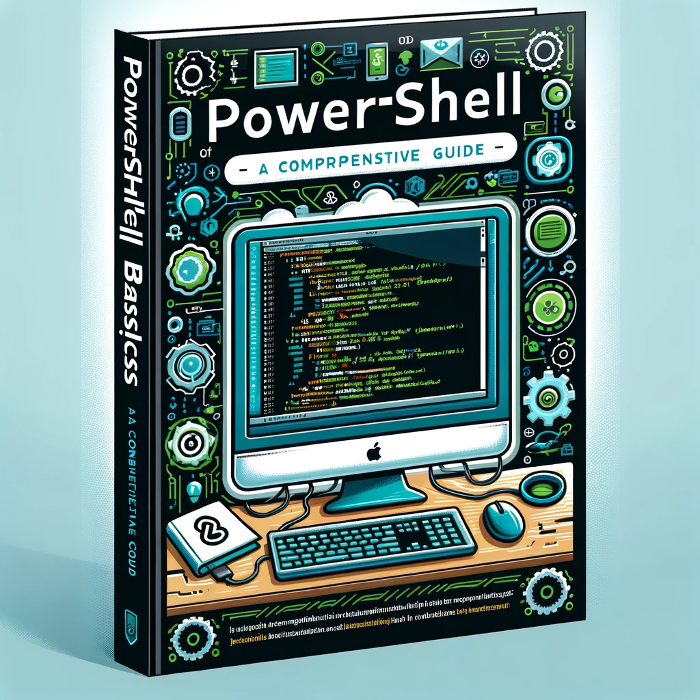

# **PowerShell Basics: A Cheat Sheet for Essential Commands**

</img>

## **What is PowerShell?**
PowerShell is a Microsoft-created command-line shell and scripting language. It is designed for system administration, automating tasks, and managing configurations. Unlike traditional command-line interfaces, PowerShell leverages the power of .NET framework, offering a more sophisticated control and automation capability.

## **Getting Started**

- **Open PowerShell:** You can access PowerShell through the Start menu or by typing `powershell` in the run dialog (Win + R).
- **Execution Policy:** Check the current execution policy using `Get-ExecutionPolicy`. Set a new policy using `Set-ExecutionPolicy`, if necessary, to run scripts.

## **Basic Commands**
1. **Get-Help:** 
   - **Usage:** `Get-Help <command>`
   - **Description:** Displays help about PowerShell commands and concepts.
   - **Example:** `Get-Help Get-Service`
   - **Tip:** Use `-Examples`, `-Detailed`, `-Full`, or `-Online` switches for more detailed help.

2. **Get-Command:**
   - **Usage:** `Get-Command`
   - **Description:** Lists all commands available in your session.
   - **Example:** `Get-Command -Verb Get`
   - **Tip:** Useful for discovering new commands or finding a command for a specific task.

3. **Get-Service:**
   - **Usage:** `Get-Service`
   - **Description:** Retrieves the status of services on a local or remote machine.
   - **Example:** `Get-Service -Name "wuauserv"`
   - **Tip:** Combine with `Start-Service` or `Stop-Service` to manage services.

4. **Set-Location (cd):**
   - **Usage:** `Set-Location C:\`
   - **Description:** Changes the current working directory.
   - **Example:** `Set-Location -Path C:\Users\Username\Documents`
   - **Tip:** Use `Push-Location` and `Pop-Location` to navigate without losing your current location.

5. **Get-ChildItem (dir/ls):**
   - **Usage:** `Get-ChildItem`
   - **Description:** Lists items in the current directory.
   - **Example:** `Get-ChildItem -Path C:\ -Recurse`
   - **Tip:** Use `-File`, `-Directory`, or `-Hidden` switches to filter results.

6. **Copy-Item (copy):**
   - **Usage:** `Copy-Item "path\source" -Destination "path\destination"`
   - **Description:** Copies an item from one location to another.
   - **Example:** `Copy-Item "C:\file.txt" -Destination "D:\"`
   - **Tip:** Use `-Recurse` for copying directories and `-Force` to overwrite existing files without prompting.

7. **Remove-Item (del/rm):**
   - **Usage:** `Remove-Item "path"`
   - **Description:** Deletes an item.
   - **Example:** `Remove-Item "C:\temp\*.*" -Recurse`
   - **Tip:** Use with caution; `-Force` can delete read-only files, and `-Recurse` can delete directories.

8. **New-Item:**
   - **Usage:** `New-Item -Path "path" -ItemType File`
   - **Description:** Creates a new item.
   - **Example:** `New-Item -Path "C:\temp\newfile.txt" -ItemType "file"`
   - **Tip:** Can create various types of items including files, directories, and registry keys.

9. **Invoke-WebRequest:**
   - **Usage:** `Invoke-WebRequest -Uri "website"`
   - **Description:** Sends HTTP and HTTPS requests to a web page.
   - **Example:** `Invoke-WebRequest -Uri "http://example.com" -OutFile "page.html"`
   - **Tip:** Use `-Method` for specifying HTTP methods like GET, POST, etc., and `-Headers` to add HTTP headers.

---

## **Scripting Basics**

1. **Variables:** 
   - **Description:** Variables store data that can be used and manipulated in scripts.
   - **Example:** `$userName = "JohnDoe"; $age = 25`
   - **Tip:** Use descriptive variable names for clarity. Variables can store various types of data, including strings, numbers, and objects.

2. **Loops:**
   - **For Loop:**
     - **Usage:** `for ($i = 0; $i -lt 10; $i++) {<#actions#>}`
     - **Example:** `for ($i = 1; $i -le 10; $i++) {Write-Host "Number $i"}`
     - **Tip:** Ideal for executing a block of code a specific number of times.

   - **Foreach Loop:**
     - **Usage:** `foreach ($item in $collection) {<#actions#>}`
     - **Example:** `foreach ($file in Get-ChildItem) {Write-Host $file.Name}`
     - **Tip:** Used to iterate over each item in a collection like an array or a list.

   - **While Loop:**
     - **Usage:** `while ($condition) {<#actions#>}`
     - **Example:** `$count = 1; while ($count -le 5) {Write-Host "Count: $count"; $count++}`
     - **Tip:** Continues to execute as long as the condition is true.

   - **Do-While Loop:**
     - **Usage:** `do {<#actions#>} while ($condition)`
     - **Example:** `$count = 1; do {Write-Host "Count: $count"; $count++} while ($count -le 5)`
     - **Tip:** Executes the block at least once before checking the condition.

3. **Conditional Statements:** 
   - **If, Elseif, Else:**
     - **Usage:** `if ($condition) {<#action#>} elseif ($otherCondition) {<#action#>} else {<#alternative action#>}`
     - **Example:** `if ($temp -gt 30) {Write-Host "It's hot"} elseif ($temp -gt 20) {Write-Host "It's warm"} else {Write-Host "It's cold"}`
     - **Tip:** Use for decision making. The script follows different paths based on the conditions.

4. **Functions:** 
   - **Description:** Functions are blocks of code designed to perform a particular task, making the script modular and reusable.
   - **Example:** `function Get-MultipliedNumber ($number) {return $number * 2}`
   - **Usage:** `Get-MultipliedNumber -number 5`
   - **Tip:** Name functions clearly. Use parameters for passing values into functions.

---

## **Advanced Commands**

1. **Get-Process:**
   - **Usage:** `Get-Process`
   - **Description:** Retrieves information about the processes running on a computer.
   - **Example:** `Get-Process -Name chrome`
   - **Tip:** Use `-Name` to filter processes by name. This command is useful for monitoring and troubleshooting running processes.

2. **Select-Object:**
   - **Usage:** `Get-Service | Select-Object Name,Status`
   - **Description:** Selects specific properties of an object.
   - **Example:** `Get-Process | Select-Object Name,CPU,StartTime`
   - **Tip:** Ideal for customizing output. Use `| Format-Table` or `| Format-List` for better display formatting.

3. **Export-Csv:**
   - **Usage:** `Get-Process | Export-Csv -Path "path\processes.csv"`
   - **Description:** Exports data to a CSV file.
   - **Example:** `Get-Service | Select-Object Name,Status | Export-Csv -Path "services.csv"`
   - **Tip:** Use `-NoTypeInformation` to exclude the type information in the CSV file. This command is great for generating reports or data analysis.

4. **Import-Module:**
   - **Usage:** `Import-Module <ModuleName>`
   - **Description:** Adds modules to your session.
   - **Example:** `Import-Module ActiveDirectory`
   - **Tip:** Modules expand PowerShell's functionality. Use `Get-Module -ListAvailable` to see what modules are available for import.

---

## **Useful Codes**

1. **Checking Disk Space:**
   - **Script:** `Get-PSDrive -PSProvider FileSystem | Select-Object Name, @{Name="UsedGB";Expression={[math]::Round(($_.Used / 1GB), 2)}}, @{Name="FreeGB";Expression={[math]::Round(($_.Free / 1GB), 2)}}`
   - **Description:** Displays the used and free space on all drives in gigabytes.
   - **Use Case:** Quickly check disk space usage on a machine.

2. **Listing Installed Software:**
   - **Script:** `Get-ItemProperty HKLM:\Software\Wow6432Node\Microsoft\Windows\CurrentVersion\Uninstall\* | Select-Object DisplayName, DisplayVersion, Publisher, InstallDate | Format-Table -AutoSize`
   - **Description:** Lists all installed software on a Windows machine.
   - **Use Case:** Useful for inventory or audit purposes.

3. **Finding Large Files:**
   - **Script:** `Get-ChildItem -Path C:\ -Recurse | Where-Object {$_.Length -gt 500MB} | Select-Object FullName, @{Name="SizeMB";Expression={[math]::Round(($_.Length / 1MB), 2)}}`
   - **Description:** Searches for files larger than 500 MB on the C drive.
   - **Use Case:** Helpful in identifying large files that might be consuming disk space.

4. **Exporting Event Logs:**
   - **Script:** `Get-EventLog -LogName Application -Newest 50 | Export-Csv -Path "C:\eventlogs.csv"`
   - **Description:** Exports the 50 most recent entries from the Application event log to a CSV file.
   - **Use Case:** Useful for troubleshooting or documenting events on a system.

5. **Bulk User Creation in Active Directory:**
   - **Script:** `Import-Csv -Path "users.csv" | ForEach-Object {New-ADUser -Name $_.Name -GivenName $_.FirstName -Surname $_.LastName -Enabled $True -PasswordNeverExpires $True -AccountPassword (ConvertTo-SecureString $_.Password -AsPlainText -Force)}`
   - **Description:** Creates multiple users in Active Directory from a CSV file.
   - **Use Case:** Efficiently handle bulk user creation, typically in a new setup or large organization.

6. **Network Ping Sweep:**
   - **Script:** `1..254 | ForEach-Object {Test-Connection -ComputerName "192.168.1.$_" -Count 1 -ErrorAction SilentlyContinue | Select-Object Address, ResponseTime}`
   - **Description:** Pings each IP in a subnet to check for live hosts.
   - **Use Case:** Useful for network diagnostics or inventory.

7. **Batch File Renaming:**
   - **Script:** `Get-ChildItem -Path "C:\Files" -Filter "*.txt" | Rename-Item -NewName {$_.Name -replace 'oldtext', 'newtext'}`
   - **Description:** Renames all .txt files in a folder by replacing a specific text in their names.
   - **Use Case:** Handy for organizing files or preparing data for processing.

## **Conclusion**

PowerShell is more than just a command-line tool; it is a powerful scripting environment that can greatly simplify and automate the management of systems and processes. Whether you are a system administrator, developer, or IT professional, understanding and utilizing PowerShell can significantly enhance your productivity and operational efficiency.

## Contact

If you have any questions, comments, or suggestions about **Powershell Cheat sheet**, please feel free to contact me:

- LinkedIn: [Halil Ibrahim Deniz](https://www.linkedin.com/in/halil-ibrahim-deniz/)
- TryHackMe: [Halilovic](https://tryhackme.com/p/halilovic)
- Instagram: [deniz.halil333](https://www.instagram.com/deniz.halil333/)
- YouTube: [Halil Deniz](https://www.youtube.com/c/HalilDeniz)
- Email: halildeniz313@gmail.com

## License
This project is licensed under the MIT License. See the [LICENSE](LICENSE) file for more details.

## 💰 You can help me by Donating
  Thank you for considering supporting me! Your support enables me to dedicate more time and effort to creating useful **Cheat Sheet** and developing new projects. By contributing, you're not only helping me improve existing tools but also inspiring new ideas and innovations. Your support plays a vital role in the growth of this project and future endeavors. Together, let's continue building and learning. Thank you!" 

 
